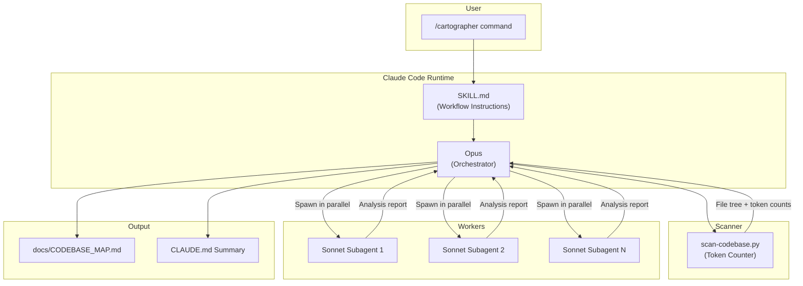
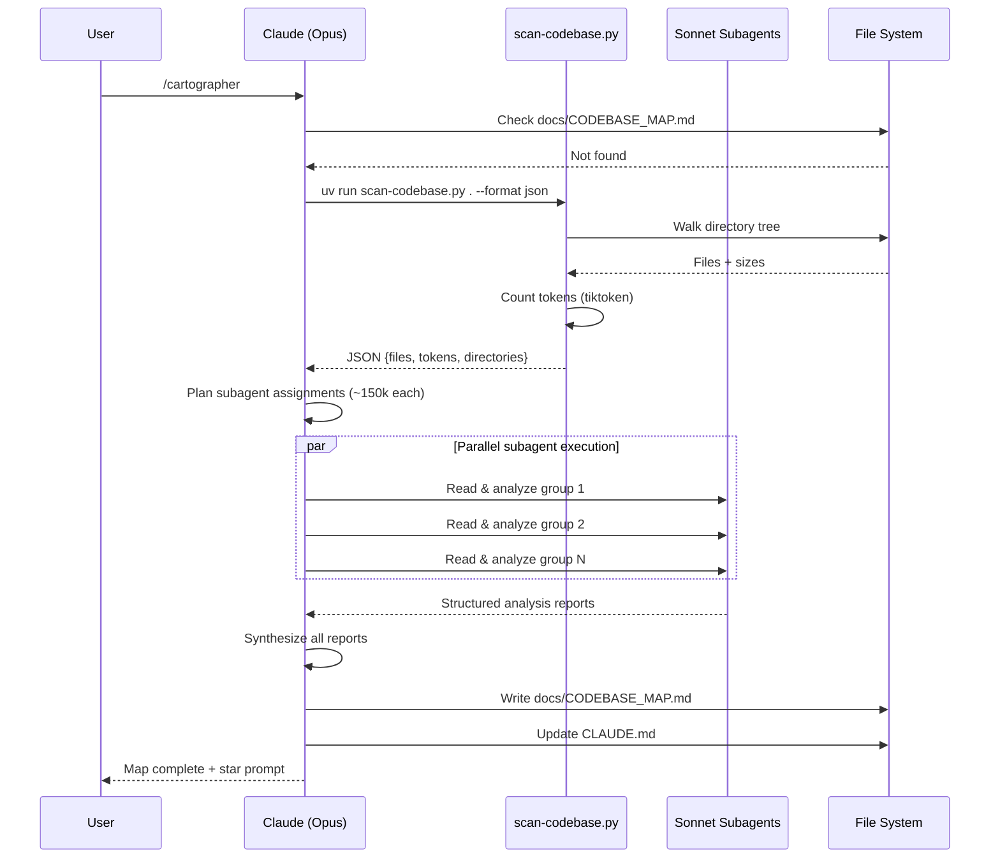
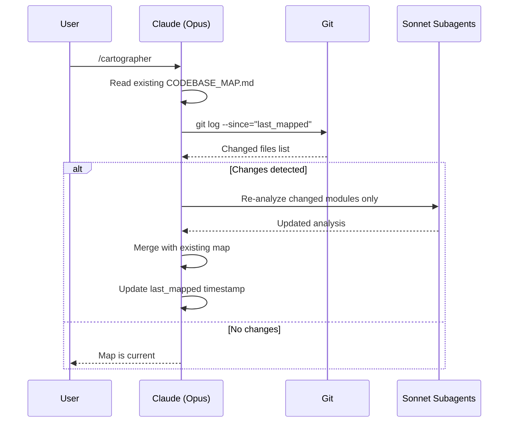

# Codebase Map

> Auto-generated by Cartographer. Last mapped: 2026-02-16T14:29:15Z

## System Overview

Cartographer is a Claude Code plugin that maps and documents codebases of any size using parallel Sonnet subagents. It follows an Orchestrator-Worker pattern: Opus plans work and synthesizes results, Sonnet subagents read and analyze code files.



## Directory Structure

```
cartographer/
├── .claude/
│   └── settings.local.json         # Local permissions (allows uv run)
├── .claude-plugin/
│   └── marketplace.json            # Marketplace distribution metadata (v1.4.0)
├── plugins/
│   └── cartographer/
│       ├── .claude-plugin/
│       │   └── plugin.json          # Plugin registration for Claude Code
│       ├── skills/
│       │   └── cartographer/
│       │       ├── scripts/
│       │       │   └── scan-codebase.py  # Recursive scanner with tiktoken (3,357 tokens)
│       │       └── SKILL.md              # Complete workflow instructions (2,150 tokens)
│       ├── LICENSE                   # MIT License (yelban, 2025)
│       └── README.md                # Plugin-level documentation (845 tokens)
├── docs/
│   └── CODEBASE_MAP.md             # Generated output (this file)
└── README.md                        # Root installation guide (492 tokens)
```

## Module Guide

### Configuration Layer

**Purpose**: Plugin registration, permissions, and marketplace metadata.

| File | Purpose | Tokens |
|------|---------|--------|
| `.claude/settings.local.json` | Grants `Bash(uv run:*)` permission for scanner | 26 |
| `.claude-plugin/marketplace.json` | Marketplace metadata: name, version, category, keywords | 190 |
| `plugins/cartographer/.claude-plugin/plugin.json` | Plugin registration with Claude Code | 59 |

**Key configuration chain**: `marketplace.json` defines source path → `plugin.json` registers plugin → Claude Code auto-discovers `skills/` directory → `SKILL.md` is loaded when triggered.

### Core Skill

**Purpose**: Workflow instructions that guide Claude through the mapping process.

| File | Purpose | Tokens |
|------|---------|--------|
| `plugins/cartographer/skills/cartographer/SKILL.md` | Complete 8-step workflow for codebase mapping | 2,150 |

**Key directives**:
- "Opus orchestrates, Sonnet reads" — never have Opus read codebase files directly
- Token budget: ~150k per Sonnet subagent
- All subagents must spawn in a single message (parallel)
- Must fetch actual system time with `date` command for timestamps
- Output: `docs/CODEBASE_MAP.md` with YAML frontmatter

**Workflow steps**: Check existing map → Scan → Plan assignments → Spawn subagents → Synthesize → Write map → Update CLAUDE.md → Completion message

### Scanner Script

**Purpose**: Recursive codebase scanner with token counting via tiktoken.

| File | Purpose | Tokens |
|------|---------|--------|
| `plugins/cartographer/skills/cartographer/scripts/scan-codebase.py` | CLI tool: scans directory tree, counts tokens per file | 3,357 |

**Key functions**:

| Function | Purpose |
|----------|---------|
| `scan_directory()` | Main entry — walks directory tree, returns file info with token counts |
| `parse_gitignore()` | Reads and parses .gitignore patterns |
| `should_ignore()` | Checks path against DEFAULT_IGNORE + .gitignore |
| `is_text_file()` | Detects text files by extension, name, or content sniffing |
| `count_tokens()` | Counts tokens using tiktoken `cl100k_base` encoding |
| `format_tree()` | Formats results as ASCII tree |

**Dependencies**: tiktoken (auto-installed via UV inline script deps, PEP 723)

**CLI usage**:
```bash
uv run scan-codebase.py [path] --format json|tree|compact --max-tokens 50000
```

**Limits**: Skips files >50k tokens or >1MB. Silently skips permission errors.

### Documentation

**Purpose**: Installation guides and licensing.

| File | Purpose | Tokens |
|------|---------|--------|
| `README.md` (root) | Installation guide, quick start, token usage warning | 492 |
| `plugins/cartographer/README.md` | Detailed plugin docs, trigger phrases, token budgets | 845 |
| `plugins/cartographer/LICENSE` | MIT License (yelban, 2025) | 219 |

## Data Flow

### Full Mapping Flow



### Update Mode Flow



## Conventions

### Naming
- Plugin/skill name: `cartographer` (lowercase, single word)
- Output file: `docs/CODEBASE_MAP.md` (uppercase, underscore-separated)
- Script: `scan-codebase.py` (kebab-case)
- Frontmatter timestamps: ISO 8601 UTC format

### Design Patterns
- **Orchestrator-Worker**: Opus plans, Sonnet executes
- **Token Budgeting**: Work split by measured token counts, not file counts
- **Incremental Updates**: Git-based change detection with timestamp tracking
- **Progressive Fallback**: UV → direct Python → python3 for scanner execution
- **PEP 723**: UV inline script dependencies for zero-config dependency management

### File Organization
- Plugin code under `plugins/<name>/`
- Skills auto-discovered from `skills/<name>/` directories
- Plugin metadata in `.claude-plugin/` directories
- Scripts in `scripts/` subdirectory within skill

## Gotchas

1. **Token budget inconsistency**: README says Sonnet has 1M context (500k budget), SKILL.md says 200k context (150k budget). SKILL.md is the execution source of truth.

2. **Timestamp generation**: Must run `date -u +"%Y-%m-%dT%H:%M:%SZ"` — never hardcode. Used for both frontmatter metadata and update-mode change detection.

3. **Gitignore parsing limitations**: Scanner's implementation is simplified — does not support negation patterns (`!pattern`). May differ from git's actual behavior.

4. **Binary detection edge cases**: Scanner uses null byte check + UTF-8 decode. Text files with exotic encodings may be incorrectly classified as binary.

5. **Permission errors silently skipped**: Scanner continues if directories are inaccessible. Major directories could be missed without warning.

6. **Restart may be required**: After plugin installation, Claude Code may need a restart for the skill to load.

7. **UV dependency**: Scanner expects `uv run` for auto-dependency installation. Without UV, tiktoken must be manually installed via pip.

## Navigation Guide

**To modify the scanning behavior**: Edit `plugins/cartographer/skills/cartographer/scripts/scan-codebase.py` — key constants are `DEFAULT_IGNORE` (skip patterns) and the `--max-tokens` default (50k).

**To change the mapping workflow**: Edit `plugins/cartographer/skills/cartographer/SKILL.md` — this is the complete instruction set Claude follows.

**To update marketplace metadata**: Edit `.claude-plugin/marketplace.json` — version, keywords, description.

**To change plugin registration**: Edit `plugins/cartographer/.claude-plugin/plugin.json`.

**To modify default permissions**: Edit `.claude/settings.local.json`.
