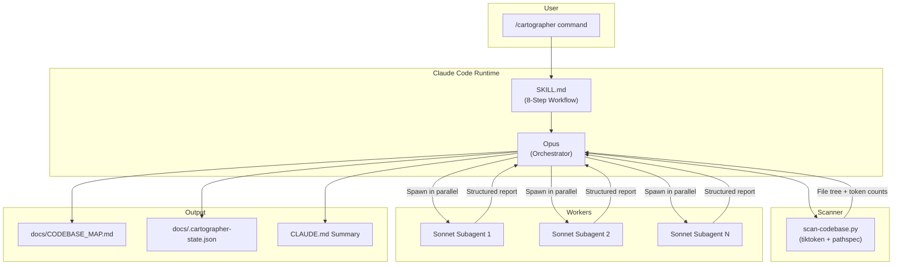
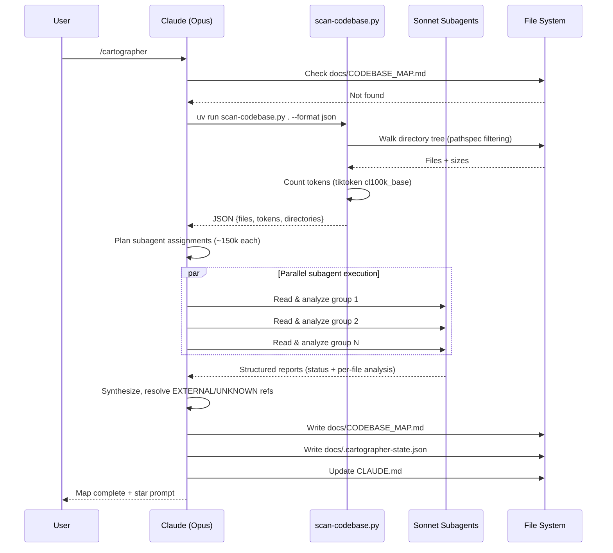
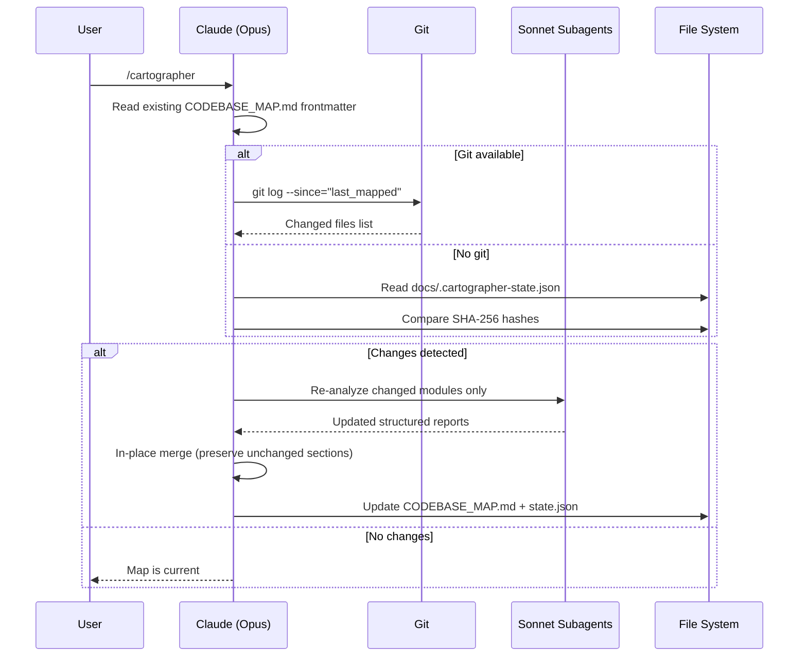

# Codebase Map

> Auto-generated by Cartographer v2.0. Last mapped: 2026-02-17T13:35:50Z

## System Overview

Cartographer is a Claude Code plugin (v2.0.0) that maps and documents codebases of any size using parallel Sonnet subagents. It follows an Orchestrator-Worker pattern: Opus plans work and synthesizes results, Sonnet subagents read and analyze code files. v2.0 replaced the hand-written gitignore parser with `pathspec`, added structured subagent output schemas, SHA-256 hash-based change detection, and symlink cycle protection.



## Directory Structure

```
cartographer/
├── .claude/
│   ├── plans/
│   │   └── 2026-02-17-cartographer-v2.0-upgrade.md  # v2.0 upgrade plan (4,109 tokens)
│   └── settings.local.json         # Local permissions (uv run, git ops)
├── .claude-plugin/
│   └── marketplace.json            # Marketplace registry (v2.0.0, metadata.upstream)
├── plugins/
│   └── cartographer/
│       ├── .claude-plugin/
│       │   └── plugin.json          # Plugin registration (v2.0.0)
│       ├── skills/
│       │   └── cartographer/
│       │       ├── scripts/
│       │       │   └── scan-codebase.py  # Recursive scanner (tiktoken + pathspec, 3,837 tokens)
│       │       └── SKILL.md              # 8-step workflow instructions (2,946 tokens)
│       ├── LICENSE                   # MIT License (Bootoshi 2025 + yelban 2026)
│       └── README.md                # Plugin-level documentation (1,003 tokens)
├── docs/
│   ├── CODEBASE_MAP.md             # Generated architecture map (this file)
│   ├── SPEC.md                     # Reverse-engineered spec (Schematic skill output, 3,625 tokens)
│   └── cartographer.md             # Project profile (Profiler skill output, 4,874 tokens)
├── CHANGELOG.md                    # Version history v1.0.0–v2.0.0 (765 tokens)
├── codex-plan.md                   # v2.0 upgrade plan (Codex Plan output, 4,109 tokens)
└── README.md                       # Root installation guide (528 tokens)
```

## Module Guide

### Configuration Layer

**Purpose**: Plugin registration, permissions, and marketplace metadata.

| File | Purpose | Tokens |
|------|---------|--------|
| `.claude/settings.local.json` | Permission allowlist: `Bash(uv run:*)`, git add/commit/push | 99 |
| `.claude-plugin/marketplace.json` | Marketplace registry with `metadata.upstream` for fork tracking | 206 |
| `plugins/cartographer/.claude-plugin/plugin.json` | Plugin name, version (2.0.0), description, author | 69 |

**Key configuration chain**: `marketplace.json` → `source: ./plugins/cartographer` → `plugin.json` registers plugin → Claude Code auto-discovers `skills/` → `SKILL.md` loaded on trigger.

**Gotcha**: `metadata.upstream` records `kingbootoshi/cartographer` as fork origin. Placed inside `metadata` object for schema compatibility — unknown root fields may be rejected by strict validators.

### Core Skill

**Purpose**: Workflow instructions that guide Claude through the mapping process.

| File | Purpose | Tokens |
|------|---------|--------|
| `plugins/cartographer/skills/cartographer/SKILL.md` | Complete 8-step workflow for codebase mapping | 2,946 |

**Key directives**:
- "Opus orchestrates, Sonnet reads" — never have Opus read codebase files directly
- Token budget: ~150k per Sonnet subagent (200k context window)
- All subagents MUST spawn in a single message (parallel)
- Must fetch actual system time with `date -u` for timestamps — never hardcode
- Output: `docs/CODEBASE_MAP.md` with YAML frontmatter

**v2.0 additions**:
- Structured subagent output schema with `status: COMPLETE|PARTIAL|FAILED`, `analyzed_paths`, `failed_paths`
- Per-file analysis limit: 150 words, `[EXTERNAL/UNKNOWN]` import labeling
- Three new output sections: Entry Points, Data Models & Schema, External Integrations
- SHA-256 hash-based incremental updates via `docs/.cartographer-state.json`
- Fallback change detection for non-git environments

**Workflow steps**: Check existing map → Scan → Plan assignments → Spawn subagents → Synthesize → Write map → Update CLAUDE.md → Completion message

### Scanner Script

**Purpose**: Recursive codebase scanner with token counting via tiktoken and gitignore matching via pathspec.

| File | Purpose | Tokens |
|------|---------|--------|
| `plugins/cartographer/skills/cartographer/scripts/scan-codebase.py` | CLI: scans directory tree, counts tokens, respects gitignore | 3,837 |

**Key functions**:

| Function | Purpose |
|----------|---------|
| `scan_directory(root, encoding, max_file_tokens)` | Main entry — walks directory tree via nested `walk()` closure |
| `load_gitignore(directory)` | Reads `.gitignore` and returns raw pattern lines (v2.0: replaces `parse_gitignore`) |
| `is_text_file(path)` | Detects text files by extension, name, or content sniffing |
| `count_tokens(text, encoding)` | Counts tokens using tiktoken `cl100k_base`; fallback `len // 3` |
| `format_tree(scan_result, show_tokens)` | Formats results as ASCII tree |
| `main()` | CLI entry point with argparse |

**v2.0 changes**:
- **pathspec integration**: `pathspec.PathSpec.from_lines('gitwildmatch', ...)` replaces hand-written `parse_gitignore()`, `matches_pattern()`, `should_ignore()`
- **Nested gitignore support**: `walk()` maintains a stack of `(pathspec, depth)` specs
- **Symlink cycle protection**: tracks `visited_real_paths: set[str]` of resolved paths
- **Token fallback**: changed from `len(text) // 4` to `// 3` (more conservative)
- **Extended file types**: added `.astro`, `.cjs`, `.mjs`, `.bicep`, `go.mod`, `go.sum`
- **Extended ignore dirs**: added `.turbo/`, `.nx/`, `.svelte-kit/`

**Dependencies**: tiktoken, pathspec (auto-installed via PEP 723 inline script deps with `uv run`)

**CLI usage**:
```bash
uv run scan-codebase.py [path] --format json|tree|compact --max-tokens 50000
```

**Limits**: Skips files >50k tokens or >1MB. Silently skips permission errors.

### Documentation

**Purpose**: Installation guides, licensing, and version history.

| File | Purpose | Tokens |
|------|---------|--------|
| `README.md` (root) | Installation guide, quick start, token usage warning | 528 |
| `plugins/cartographer/README.md` | Detailed plugin docs, trigger phrases, token budgets, v2.0 output structure | 1,003 |
| `plugins/cartographer/LICENSE` | MIT License — dual copyright: Bootoshi (2025) + yelban (2026) | 230 |
| `CHANGELOG.md` | Version history from v1.0.0 to v2.0.0 (6 releases) | 765 |

### Generated Docs (Skill Outputs)

**Purpose**: Documents generated by other Claude Code skills, not part of the core plugin logic.

| File | Purpose | Tokens |
|------|---------|--------|
| `docs/SPEC.md` | Reverse-engineered specification (Schematic skill) — 11 chapters | 3,625 |
| `docs/cartographer.md` | LLM-optimized project profile (Project Profiler skill) | 4,874 |

**Gotcha**: `docs/SPEC.md` was generated at v1.4.0 — references removed functions (`should_ignore`, `matches_pattern`, `parse_gitignore`) and old token fallback (`// 4`). `docs/cartographer.md` lists `fnmatch` as a dependency, which was replaced by `pathspec` in v2.0.

### Planning Artifacts

**Purpose**: Implementation plans for v2.0 upgrade.

| File | Purpose | Tokens |
|------|---------|--------|
| `codex-plan.md` | v2.0 upgrade plan (Codex Plan skill) — 5 phases, 14 tasks | 4,109 |
| `.claude/plans/2026-02-17-cartographer-v2.0-upgrade.md` | Archived copy of codex-plan.md | 4,109 |

**Note**: Identical content in both files — archive convention per CLAUDE.md rules. Phase 1 (test scaffolding) was skipped; dogfooding used instead.

## Entry Points

| Entry Point | File | Description |
|-------------|------|-------------|
| `/cartographer` command | `SKILL.md` | Loaded by Claude Code runtime; orchestrates the entire mapping workflow |
| Scanner CLI | `scan-codebase.py:main()` | Standalone usage: `uv run scan-codebase.py . --format json` |
| Marketplace install | `.claude-plugin/marketplace.json` | Discovery via `claude plugins add yelban/cartographer` |

## Data Models & Schema

No database or ORM. Key data structures:

| Structure | Location | Description |
|-----------|----------|-------------|
| Scanner JSON output | `scan-codebase.py` | `{root, files: [{path, tokens, size_bytes}], directories: [...], total_tokens, total_files, skipped: [...]}` |
| CODEBASE_MAP frontmatter | `docs/CODEBASE_MAP.md` | `{last_mapped: ISO8601, total_files: int, total_tokens: int}` |
| Cartographer state | `docs/.cartographer-state.json` | `{last_mapped: ISO8601, scanner_version: str, files: {path: sha256_hash}}` |
| Subagent report | (in-memory) | Structured markdown with `status`, `analyzed_paths`, `failed_paths`, per-file analysis |
| Plugin manifest | `plugin.json` | `{name, version, description, author: {name, url}}` |
| Marketplace registry | `marketplace.json` | `{name, version, source, category, keywords, description, metadata: {upstream}}` |

## External Integrations

| Service | Purpose | Config Location |
|---------|---------|-----------------|
| tiktoken | Token counting (cl100k_base encoding) | PEP 723 inline deps in scan-codebase.py |
| pathspec | Gitignore pattern matching (gitwildmatch) | PEP 723 inline deps in scan-codebase.py |
| Claude Code Runtime | Plugin host, `${CLAUDE_PLUGIN_ROOT}` env var | `.claude-plugin/` manifests |
| Git | Change detection for incremental updates | Optional; fallback to SHA-256 state file |
| UV | PEP 723 dependency auto-installation | `.claude/settings.local.json` permission |

## Data Flow

### Full Mapping Flow



### Update Mode Flow



## Conventions

### Naming
- Plugin/skill name: `cartographer` (lowercase, single word)
- Output file: `docs/CODEBASE_MAP.md` (uppercase, underscore-separated)
- Script: `scan-codebase.py` (kebab-case)
- Frontmatter timestamps: ISO 8601 UTC format
- Repository: `yelban/cartographer` (forked from `kingbootoshi/cartographer`)

### Design Patterns
- **Orchestrator-Worker**: Opus plans, Sonnet executes — strict separation enforced by SKILL.md
- **Token Budgeting**: Work split by measured token counts (~150k per subagent), not file counts
- **Incremental Updates**: Git-based change detection with timestamp tracking; SHA-256 fallback
- **Progressive Fallback**: UV → direct Python → python3 for scanner; git → state.json for changes
- **PEP 723**: UV inline script dependencies for zero-config dependency management
- **Structured Reports**: Subagent output uses strict schema with status/paths/per-file analysis

### File Organization
- Plugin code under `plugins/<name>/`
- Skills auto-discovered from `skills/<name>/` directories
- Plugin metadata in `.claude-plugin/` directories
- Scripts in `scripts/` subdirectory within skill
- Generated docs in `docs/`
- Planning artifacts archived in `.claude/plans/`

## Gotchas

1. **Timestamp generation**: Must run `date -u +"%Y-%m-%dT%H:%M:%SZ"` — never hardcode. Used for frontmatter metadata and update-mode change detection.

2. **Binary detection edge cases**: Scanner uses null byte check + UTF-8 decode. Text files with exotic encodings may be incorrectly classified as binary.

3. **Permission errors silently skipped**: Scanner continues if directories are inaccessible. Major directories could be missed without warning.

4. **Restart may be required**: After plugin installation, Claude Code may need a restart for the skill to load.

5. **UV dependency**: Scanner expects `uv run` for auto-dependency installation. Without UV, tiktoken and pathspec must be manually installed via pip.

6. **Stale generated docs**: `docs/SPEC.md` was generated at v1.4.0 — references removed functions and old behavior. `docs/cartographer.md` still lists `fnmatch` as a dependency (replaced by `pathspec` in v2.0). These files need regeneration to match current code.

7. **Dual plan files**: `codex-plan.md` and `.claude/plans/2026-02-17-cartographer-v2.0-upgrade.md` are identical — maintaining both is the intended convention.

8. **Plugin cache vs local**: The `/cartographer` command reads from `~/.claude/plugins/cache/`, not from the local working directory. Local edits require plugin reinstallation to take effect.

## Navigation Guide

**To modify scanning behavior**: Edit `plugins/cartographer/skills/cartographer/scripts/scan-codebase.py` — key constants: `DEFAULT_IGNORE_PATTERNS` (skip patterns), `TEXT_EXTENSIONS` (file types), `--max-tokens` default (50k).

**To change the mapping workflow**: Edit `plugins/cartographer/skills/cartographer/SKILL.md` — complete instruction set Claude follows. Includes subagent output schema template.

**To update marketplace metadata**: Edit `.claude-plugin/marketplace.json` — version, keywords, description, `metadata.upstream`.

**To change plugin registration**: Edit `plugins/cartographer/.claude-plugin/plugin.json` — name, version, author.

**To modify permissions**: Edit `.claude/settings.local.json` — Bash command allowlist.

**To add a new output section**: Update the CODEBASE_MAP template in `SKILL.md` Step 6, then regenerate.

**To update version**: Bump version in `plugin.json` + `marketplace.json`, add entry to `CHANGELOG.md`.
