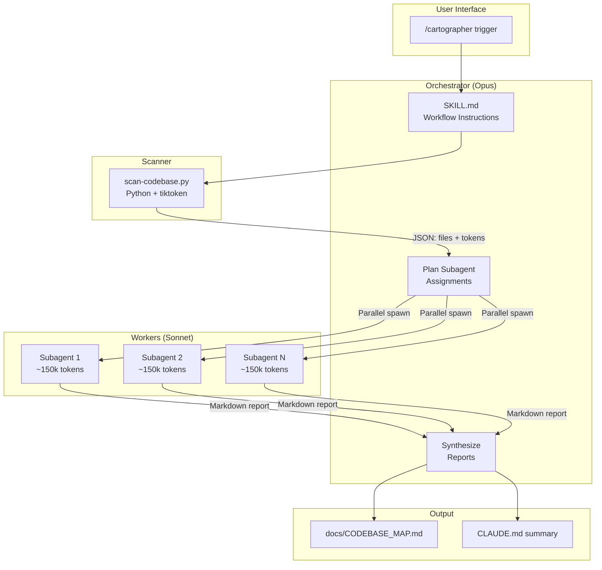
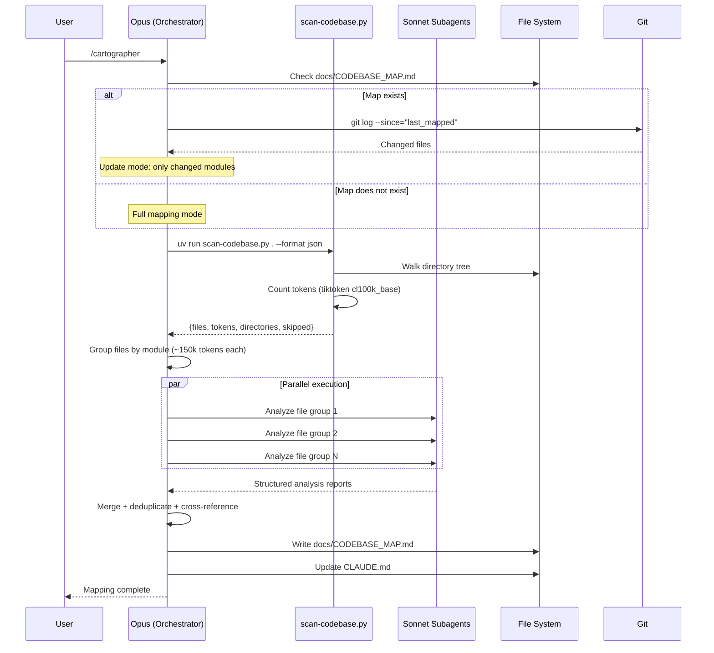

# Cartographer
## Reverse-Engineered Product & Technical Specification

> Generated: 2026-02-16T14:39:13Z | Branch: `main` | 17 commits | 8 files | v1.4.0

---

## 1. Problem Statement

Feature branches and open-source projects often lack comprehensive architecture documentation. Developers joining a new codebase spend hours manually reading files to understand structure, conventions, and data flow. For large codebases (100k+ tokens), this process is especially painful — no single context window can hold the entire codebase.

**Cartographer** solves this by automating codebase mapping through parallel AI subagents, producing a structured `docs/CODEBASE_MAP.md` with architecture diagrams, module guides, and navigation instructions.

**Target users**: Developers onboarding to unfamiliar codebases, teams needing auto-generated architecture docs, or anyone who wants a quick structural overview of a project.

---

## 2. Solution Overview

A Claude Code plugin that orchestrates parallel Sonnet subagents to read, analyze, and document codebases of any size.

**Key design properties**:
- **Parallel**: Multiple Sonnet subagents read file groups simultaneously
- **Token-aware**: A Python scanner counts tokens per file; work is split to stay within context limits
- **Incremental**: Detects changes since last mapping via git history; only re-analyzes modified modules
- **Zero-config**: UV inline script dependencies (PEP 723) eliminate manual `pip install`
- **Cost-conscious**: Opus orchestrates (expensive, minimal tokens), Sonnet reads (capable, cheaper)

---

## 3. Product Requirements

### 3.1 User-Facing Behavior

| Requirement | Implementation |
|-------------|---------------|
| Trigger via natural language or slash command | `/cartographer`, "map this codebase", "document the architecture" |
| Scan any codebase regardless of size | Token-based work splitting across parallel subagents |
| Produce structured markdown documentation | `docs/CODEBASE_MAP.md` with frontmatter, diagrams, tables |
| Support incremental updates | Git-based change detection using `last_mapped` timestamp |
| Respect .gitignore | Scanner parses .gitignore patterns |
| Skip binary and oversized files | Configurable limits (1MB size, 50k tokens) |
| Work without global pip installs | UV inline script dependencies (PEP 723) |
| Warn about token costs | README includes usage warning with Haiku alternative |

### 3.2 Supported Workflows

1. **Full mapping** — First run on a new codebase; scans everything, spawns subagents, writes complete map
2. **Incremental update** — Detects changes since `last_mapped`; re-analyzes only modified modules
3. **Cost-optimized mapping** — User requests Haiku subagents instead of Sonnet for cheaper (less accurate) runs

### 3.3 Scope Boundaries

**In scope**: File structure analysis, module relationships, architecture diagrams, conventions, gotchas, navigation guides.

**Out of scope**: Runtime behavior analysis, performance profiling, security auditing, test execution, dependency vulnerability scanning.

---

## 4. Architecture

### 4.1 System Diagram



### 4.2 Data Lifecycle



---

## 5. Technical Design

### 5.1 Scanner Design (`scan-codebase.py`)

**Purpose**: Recursive directory scanner that produces a JSON manifest of all text files with token counts.

**Core algorithm**:
1. Walk directory tree recursively
2. Filter out ignored paths (DEFAULT_IGNORE + .gitignore)
3. Detect text files (extension check + null byte + UTF-8 decode)
4. Count tokens using tiktoken `cl100k_base` encoding
5. Skip files exceeding size/token limits
6. Return JSON with file list, token counts, directories, and skipped files

**Key constants**:

| Constant | Value | Purpose |
|----------|-------|---------|
| DEFAULT_IGNORE dirs | `.git`, `node_modules`, `__pycache__`, `dist`, `build`, etc. | Skip common non-source directories |
| DEFAULT_IGNORE files | `*.pyc`, `*.lock`, `package-lock.json`, etc. | Skip generated/binary files |
| Max file size | 1 MB | Prevent reading huge files |
| Max tokens per file | 50,000 (configurable via `--max-tokens`) | Skip files too large for useful analysis |
| Encoding | `cl100k_base` | GPT-4/Claude compatible tokenizer |

**Output formats**: `json` (default, structured), `tree` (ASCII with annotations), `compact` (sorted by token count).

**Dependency management**: PEP 723 inline script metadata enables `uv run` to auto-install tiktoken in an isolated environment.

```python
# /// script
# requires-python = ">=3.9"
# dependencies = ["tiktoken"]
# ///
```

### 5.2 Token Budgeting Strategy

| Codebase Size | Subagents | Budget per Subagent | Rationale |
|---------------|-----------|---------------------|-----------|
| < 100k tokens | 1 | All tokens | Single subagent sufficient |
| 100k–300k | 2 | ~150k each | Split by module boundary |
| 300k–600k | 3–4 | ~150k each | Balance across directories |
| 600k+ | 4+ | ~150k each | More subagents, smaller chunks |

**Safe margin**: 150k out of 200k context (75%) — leaves 50k for prompt template + response generation.

**Grouping heuristic**: Files grouped by directory/module to keep related code together. Token counts balanced across groups.

### 5.3 Orchestrator-Worker Pattern

| Role | Model | Responsibilities | Token Usage |
|------|-------|-----------------|-------------|
| Orchestrator | Opus | Run scanner, plan assignments, synthesize reports, infer architecture | Minimal (no file reading) |
| Worker | Sonnet | Read assigned files, analyze code, return structured markdown | Up to 150k per subagent |

**Critical rule**: Opus never reads codebase files directly. Even for small codebases (<100k tokens), a single Sonnet subagent is spawned.

**Parallel spawning**: All subagents must be launched in a single message with multiple Task tool calls. Sequential spawning is explicitly prohibited for performance reasons.

### 5.4 Incremental Update Mechanism

**Change detection** (in order of preference):
1. Git history: `git log --oneline --since="<last_mapped_timestamp>"`
2. Scanner comparison: Re-scan and diff file counts/paths against frontmatter

**Update behavior**:
- Only spawn subagents for changed modules
- Merge new analysis with existing map sections
- Preserve unchanged sections
- Update `last_mapped` timestamp (must fetch actual system time via `date -u`)

### 5.5 Output Structure (`CODEBASE_MAP.md`)

```yaml
---
last_mapped: 2026-02-16T14:29:15Z  # Actual system time, never estimated
total_files: 142
total_tokens: 85432
---
```

**Required sections**: System Overview (Mermaid graph), Directory Structure, Module Guide (tables), Data Flow (Mermaid sequence), Conventions, Gotchas, Navigation Guide.

### 5.6 Execution Fallback Chain

```
uv run scan-codebase.py  →  ./scan-codebase.py (shebang)  →  python3 scan-codebase.py
```

If tiktoken is missing and UV is not available, the script prints installation instructions and exits.

---

## 6. New Files (Current State)

| File | Purpose |
|------|---------|
| `.claude/settings.local.json` | Grants `Bash(uv run:*)` permission for scanner execution |
| `.claude-plugin/marketplace.json` | Marketplace container: name, owner, plugin list (v1.4.0) |
| `plugins/cartographer/.claude-plugin/plugin.json` | Plugin registration: name, description, author |
| `plugins/cartographer/skills/cartographer/SKILL.md` | Complete 8-step workflow instructions for Claude |
| `plugins/cartographer/skills/cartographer/scripts/scan-codebase.py` | Recursive codebase scanner with tiktoken token counting |
| `plugins/cartographer/LICENSE` | MIT License (yelban) |
| `plugins/cartographer/README.md` | Plugin-level technical documentation |
| `README.md` | Root installation guide and marketing |

---

## 7. Modified Files (Key Changes Across Versions)

| File | Key Changes |
|------|-------------|
| `SKILL.md` | v1.1: Added "Opus orchestrates, Sonnet reads" rule + Mermaid diagrams. v1.2: Token budget 500k→150k. v1.3: Star prompt on completion. v1.4: UV inline deps + fallback chain. Post-v1.4: Timestamp must use `date -u` |
| `marketplace.json` | Created at f9c89bc, format fixed 3 times (e238cbe, 778706f), version bumped through v1.1–v1.4 |
| `README.md` (root) | Restructured from full docs to installation guide. Added token usage warning. Added hero image |
| `plugin.json` | v1.0: Monolithic config at root. Restructured to marketplace format (7ab4fa4). Added required fields (3c86774) |
| `scan-codebase.py` | v1.4: Added PEP 723 inline script metadata for UV auto-dependency |
| Entire directory structure | 7ab4fa4: Major restructure from flat layout to `plugins/cartographer/` marketplace format |

---

## 8. Testing Strategy

### Unit Tests

**None exist.** The project has no automated tests.

### Integration / E2E Tests

**None exist.** Validation is done through real-world usage (dogfooding).

### Implied Validation

| Method | Evidence |
|--------|----------|
| Dogfooding | Author uses Cartographer to map other projects |
| User feedback | Bug #4 (timestamp) discovered and fixed via issue |
| Iterative fixes | 17 commits over 3 weeks show rapid response to real-world issues |
| Visual inspection | Output is Markdown — easy to manually verify |

### Testing Gaps

- Scanner .gitignore parsing edge cases (negation patterns unsupported)
- Binary detection with exotic encodings
- Cross-platform path handling (Windows)
- Token counting accuracy with CJK/emoji characters
- Subagent failure recovery

---

## 9. Rollout Strategy

### Distribution

| Method | Status | Command |
|--------|--------|---------|
| Claude Code Marketplace | Active (primary) | `/plugin marketplace add yelban/cartographer` |
| Manual git clone | Supported (fallback) | Clone to `~/.claude/skills/` |

### Gating

No feature flags. The plugin is fully available once installed. Natural cost gating exists — large codebases consume significant tokens, discouraging frivolous use.

### Cost Controls

- README warns about token usage
- Users can request Haiku subagents for cheaper (less accurate) runs
- Scanner's `--max-tokens` flag controls per-file analysis limits

### Version History

| Version | Date | Key Change |
|---------|------|------------|
| v1.0.0 | 2026-01-13 | Initial release: scanner, parallel subagents, CODEBASE_MAP.md generation |
| v1.1.0 | 2026-01-13 | "Opus orchestrates, Sonnet reads" rule; Mermaid diagrams |
| v1.2.0 | 2026-01-14 | Token budget fix: 500k→150k per subagent (context was 200k, not 1M) |
| v1.3.0 | 2026-01-15 | Star prompt on completion |
| v1.4.0 | 2026-01-15 | UV inline script dependencies (PEP 723); improved error messages |
| — | 2026-02-03 | Bug fix: timestamp must use actual system time (`date -u`) |

---

## 10. Risks and Mitigations

| Risk | Severity | Mitigation |
|------|----------|------------|
| Token cost surprise for large codebases | Medium | README warning + Haiku alternative |
| Scanner misclassifies text as binary | Low | Extension whitelist + content sniffing; silent skip with `skipped` list |
| Gitignore parsing differs from git | Low | Simplified implementation; no negation pattern support |
| Subagent exceeds context window | Medium | Conservative 150k budget (75% of 200k) |
| Stale map after code changes | Low | Incremental update mode with git-based detection |
| Timestamp estimation breaks update detection | High (fixed) | v1.4.0+ forces `date -u` for actual system time |
| Plugin doesn't load after install | Low | README notes restart may be required |
| No automated tests | Medium | Risk of regression; mitigated by small codebase and dogfooding |
| Permission errors silently skip directories | Low | Scanner logs skipped files in JSON output |

---

## 11. Summary

**Cartographer** is a Claude Code plugin (MIT, by yelban) that maps codebases using parallel Sonnet subagents.

| Metric | Value |
|--------|-------|
| Total commits | 17 |
| Current version | v1.4.0 |
| Total files | 8 |
| Total tokens | 7,338 |
| Lines added | 311 (from initial to HEAD) |
| Lines removed | 148 (from initial to HEAD) |
| Automated tests | 0 |
| Time span | 2026-01-13 to 2026-02-03 (~3 weeks) |

**Core innovation**: Token-aware parallel subagent orchestration — the scanner measures exact token counts per file, enabling intelligent work splitting that keeps each subagent within context limits.

**Evolution pattern**: Rapid iteration driven by real-world usage — marketplace restructure, token budget correction, dependency management modernization, and timestamp bug fix all came from practical use rather than upfront design.
