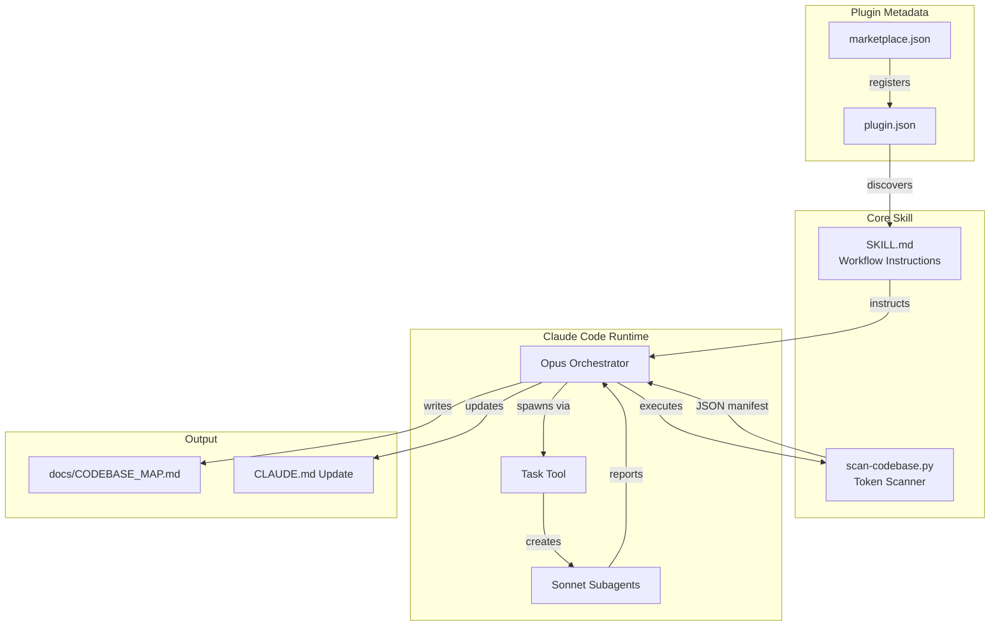
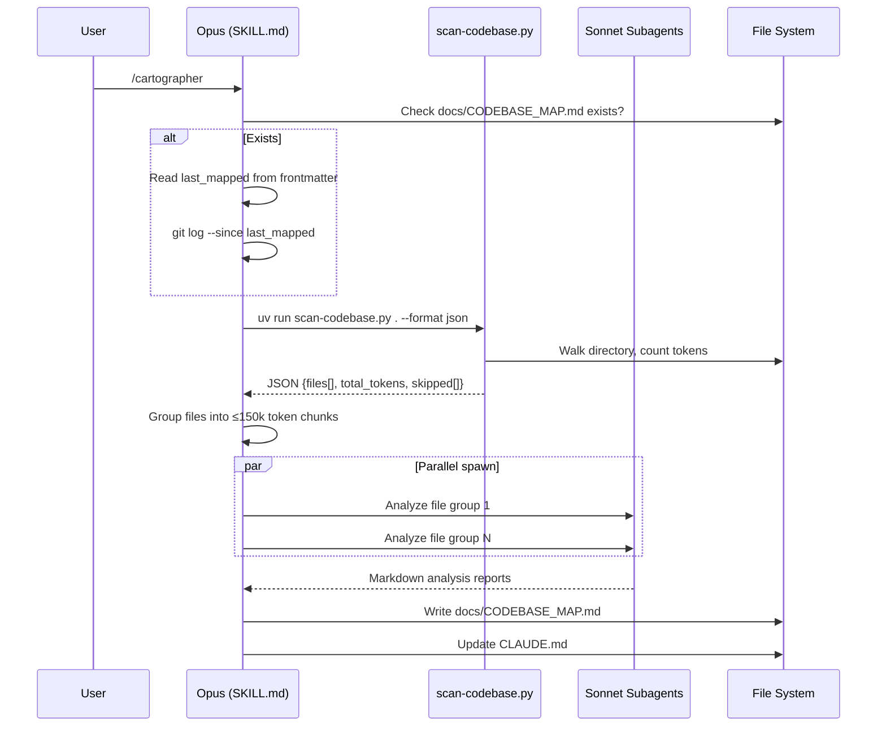

# Cartographer

> Not a code library or framework — a Claude Code plugin that generates codebase architecture documentation by orchestrating parallel Sonnet subagents.

| Field | Value |
|-------|-------|
| **Language** | Markdown (72.2% by tokens), Python (25.6%), JSON (2.2%) |
| **Framework** | Claude Code Plugin System |
| **Package Manager** | UV (PEP 723 inline script deps) |
| **Version** | 1.4.0 |
| **License** | MIT |
| **Dependencies** | 1 direct (tiktoken, declared inline in script) |
| **First Commit** | 2026-01-13 |
| **Contributors** | 1 |
| **Releases** | 0 (versions tracked in `marketplace.json` only) |
| **Maturity** | Experimental |
| **Stars / Forks** | 468 / 31 |
| **Monthly Downloads** | N/A (distributed via Claude Code marketplace, not npm/PyPI) |
| **CI** | None detected |
| **Tests** | No |
| **Docker** | No |

---

## 2. Architecture

> Plugin system architecture: a Markdown instruction file (`SKILL.md`) drives Claude's orchestration of parallel Sonnet subagents, with a Python scanner providing token-counted file inventories.

### 2.1 System Topology

### 2.1b Module Dependencies (structured)

- **marketplace.json** (`.claude-plugin/marketplace.json`): references [plugin.json via `source` path]
- **plugin.json** (`plugins/cartographer/.claude-plugin/plugin.json`): standalone, discovered by Claude Code runtime
- **SKILL.md** (`plugins/cartographer/skills/cartographer/SKILL.md`): references [scan-codebase.py via `${CLAUDE_PLUGIN_ROOT}` path]
- **scan-codebase.py** (`plugins/cartographer/skills/cartographer/scripts/scan-codebase.py`): imports [tiktoken, argparse, json, sys, pathlib, fnmatch]
- **settings.local.json** (`.claude/settings.local.json`): standalone permission config

### 2.2 Layer Boundaries

| Layer | Modules | Responsibility |
|-------|---------|---------------|
| Distribution | `marketplace.json`, `plugin.json` | Plugin registration with Claude Code marketplace |
| Instructions | `SKILL.md` | 8-step workflow that Claude follows at runtime |
| Tooling | `scan-codebase.py` | Recursive file scanning with tiktoken token counting |
| Configuration | `settings.local.json` | Grants `Bash(uv run:*)` and `Bash(git ls-tree:*)` permissions |
| Documentation | `README.md` (root), `README.md` (plugin) | Installation guide and technical docs |

### 2.3 Data Flow

### 2.3b Data Flow (structured)

1. **Full mapping**: User trigger → SKILL.md loaded → `scan-codebase.py` executed → JSON manifest → token-based grouping → parallel Sonnet subagents → report synthesis → `docs/CODEBASE_MAP.md` written
2. **Incremental update**: User trigger → read `last_mapped` frontmatter → `git log --since` → re-scan changed modules only → merge with existing map

---

## 3. Core Abstractions

> 6 core abstractions identified. The project is split between a Python scanner (4 functions) and a Markdown instruction system (2 structured documents).

### scan_directory

| Field | Value |
|-------|-------|
| **Purpose** | Recursively walks directory tree and returns file manifest with token counts |
| **Defined in** | `scan-codebase.py:scan_directory` |
| **Methods/Fields** | 1 public function, returns dict with 5 keys (files, directories, total_tokens, total_files, skipped) |
| **Adapters/Implementations** | 0 — standalone function |
| **Used by** | `scan-codebase.py:main` (1 file) |

### should_ignore

| Field | Value |
|-------|-------|
| **Purpose** | Checks paths against DEFAULT_IGNORE (83 patterns) and .gitignore rules |
| **Defined in** | `scan-codebase.py:should_ignore` |
| **Methods/Fields** | 1 public function, delegates to `matches_pattern` for gitignore |
| **Adapters/Implementations** | 0 — standalone function |
| **Used by** | `scan-codebase.py:scan_directory` via inner `walk()` (1 file) |

### is_text_file

| Field | Value |
|-------|-------|
| **Purpose** | Detects text files via extension whitelist (113 extensions), name check (16 names), and binary sniffing |
| **Defined in** | `scan-codebase.py:is_text_file` |
| **Methods/Fields** | 1 public function, 3-stage detection pipeline |
| **Adapters/Implementations** | 0 — standalone function |
| **Used by** | `scan-codebase.py:scan_directory` via inner `walk()` (1 file) |

### count_tokens

| Field | Value |
|-------|-------|
| **Purpose** | Counts tokens using tiktoken cl100k_base encoding with `len(text)//4` fallback |
| **Defined in** | `scan-codebase.py:count_tokens` |
| **Methods/Fields** | 1 public function |
| **Adapters/Implementations** | 0 — standalone function |
| **Used by** | `scan-codebase.py:scan_directory` via inner `walk()` (1 file) |

### SKILL.md Workflow

| Field | Value |
|-------|-------|
| **Purpose** | 8-step instruction set that drives Claude's orchestration of the entire mapping process |
| **Defined in** | `SKILL.md` (2,150 tokens) |
| **Methods/Fields** | 8 steps: check existing → scan → plan → spawn subagents → synthesize → write map → update CLAUDE.md → completion |
| **Adapters/Implementations** | 0 — single workflow |
| **Used by** | Claude Code runtime when `/cartographer` is triggered |

### DEFAULT_IGNORE

| Field | Value |
|-------|-------|
| **Purpose** | Hardcoded set of 83 patterns for directories, files, binaries, and generated assets to skip |
| **Defined in** | `scan-codebase.py:DEFAULT_IGNORE` |
| **Methods/Fields** | 1 set constant: 15 directories, 20 file patterns, 23 binary/media extensions, 6 lock files, 6 generated file patterns, 13 compiled extensions |
| **Adapters/Implementations** | 0 — constant |
| **Used by** | `scan-codebase.py:should_ignore` (1 file) |

---

## 4. Concurrency & Multi-Agent

> Agent orchestration pattern: Opus orchestrator spawns 1-N parallel Sonnet subagents via Claude Code's Task tool, each bounded to ≤150k tokens.

| Component | Detail |
|-----------|--------|
| **Pattern** | Agent orchestration (Opus → parallel Sonnet subagents) |
| **Concurrency primitives** | Claude Code `Task` tool with `subagent_type: "Explore"`, `model: "sonnet"` — `SKILL.md:Step 4` |
| **Agent count** | 1 orchestrator (Opus) + 1-N workers (Sonnet), where N = ceil(total_tokens / 150,000) |
| **Constraint** | All subagents must launch in a single message (parallel, not sequential) — `SKILL.md:Step 4` |

---

## 5. Usage Guide

> 2 consumption interfaces: Claude Code skill trigger and Python CLI scanner.

### 5.1 Consumption Interfaces

| Interface | Entry Point | Example |
|-----------|------------|---------|
| Claude Code Skill | `SKILL.md` via `/cartographer` command | `/cartographer` or "map this codebase" |
| Python CLI | `scan-codebase.py:main` | `uv run scan-codebase.py . --format json` |

### 5.2 Configuration

| Config Source | Path | Key Settings |
|--------------|------|-------------|
| Plugin metadata | `.claude-plugin/marketplace.json` | Plugin version (1.4.0), category, keywords |
| Plugin registration | `plugins/cartographer/.claude-plugin/plugin.json` | Plugin name, description, author |
| Permissions | `.claude/settings.local.json` | `Bash(uv run:*)`, `Bash(git ls-tree:*)` |
| CLI arguments | `scan-codebase.py` argparse | `--format` (json/tree/compact), `--max-tokens` (default 50000), `--encoding` (default cl100k_base) |

### 5.3 Deployment Modes

| Mode | How | Prerequisites |
|------|-----|--------------|
| Marketplace install | `/plugin marketplace add yelban/cartographer` → `/plugin install cartographer` | Claude Code with plugin support |
| Manual clone | `git clone` to `~/.claude/skills/cartographer` | Claude Code, tiktoken (`pip install tiktoken`) |

### 5.4 AI Agent Integration

| Pattern | Detail |
|---------|--------|
| **Protocol** | Claude Code Plugin/Skill system |
| **Tools exposed** | 1 skill (`/cartographer`) |
| **Entry point** | `SKILL.md` — loaded by Claude Code when skill triggers |
| **Agent model** | Orchestrator (Opus) + Workers (Sonnet), using Task tool with `subagent_type: "Explore"` |

---

## 6. Performance & Cost

> Token consumption is the primary cost driver; scales linearly with codebase size.

| Metric | Value | Source |
|--------|-------|--------|
| Scanner overhead | 3,357 tokens for scanner code loaded into context | `scan-codebase.py` (3,357 tokens) |
| SKILL.md overhead | 2,150 tokens for workflow instructions loaded into context | `SKILL.md` (2,150 tokens) |
| Subagent budget | ≤150,000 tokens per Sonnet subagent | `SKILL.md:Step 3` |
| File size limit | 1 MB per file, 50,000 tokens per file | `scan-codebase.py:scan_directory` (hardcoded 1,000,000 bytes; argparse default 50000 tokens) |
| Cache strategy | None — full re-scan each run; incremental mode uses git timestamps for change detection | `SKILL.md:Step 1` |

---

## 7. Security & Privacy

> Minimal security surface — reads local files only, no network calls, no auth.

| Aspect | Detail |
|--------|--------|
| **API Key Management** | None — no external API calls |
| **Auth Pattern** | None — runs within Claude Code's permission system |
| **Data at Rest** | Plaintext — scanner reads files, output is Markdown |
| **PII Handling** | None detected — processes source code, not user data |
| **Permission Gating** | `.claude/settings.local.json` restricts to `Bash(uv run:*)` and `Bash(git ls-tree:*)` |

---

## 8. Design Decisions

> 5 key decisions shaped this project. Each reflects a constraint of the Claude Code plugin ecosystem.

### 8.1 Instruction-as-Code via SKILL.md

| Aspect | Detail |
|--------|--------|
| **Problem** | How to make Claude follow a multi-step workflow reliably |
| **Choice** | Encode the entire workflow as structured Markdown in `SKILL.md` with explicit step numbers, bash commands, and output templates |
| **Alternatives** | Python orchestration script (rejected: Claude Code plugins load skills as Markdown, not executable code), JSON config (rejected: too rigid for conditional logic) |
| **Tradeoffs** | Gain: human-readable, editable by non-programmers, version-controllable. Lose: no static validation, relies on LLM instruction-following fidelity |
| **Evidence** | `SKILL.md` — 310 lines of structured instructions with 8 numbered steps, bash code blocks, and template literals |

### 8.2 Opus Orchestrates, Sonnet Reads

| Aspect | Detail |
|--------|--------|
| **Problem** | Opus is expensive per-token; reading entire codebases through Opus wastes budget |
| **Choice** | Strict role separation: Opus never reads codebase files directly; Sonnet subagents handle all file I/O |
| **Alternatives** | Single-model approach (rejected: Opus reading 100k+ tokens of source code costs 3-5x more than Sonnet), Haiku workers (rejected: insufficient analysis quality for complex codebases) |
| **Tradeoffs** | Gain: cost reduction proportional to codebase size. Lose: subagent spawn overhead adds latency for small codebases (<10k tokens) |
| **Evidence** | `SKILL.md` — "CRITICAL: Opus orchestrates, Sonnet reads. Never have Opus read codebase files directly." |

### 8.3 Token-Based Work Splitting

| Aspect | Detail |
|--------|--------|
| **Problem** | File count is a poor proxy for context usage — one 5k-token file uses more context than 50 config files |
| **Choice** | Pre-scan all files with tiktoken to get exact token counts, then partition into ≤150k-token groups |
| **Alternatives** | File-count splitting (rejected: uneven context usage), byte-size splitting (rejected: bytes ≠ tokens for code with comments/whitespace), no splitting (rejected: large codebases exceed any model's context) |
| **Tradeoffs** | Gain: each subagent uses context efficiently, no overflows. Lose: requires a Python scanner + tiktoken dependency |
| **Evidence** | `scan-codebase.py:count_tokens` — `len(encoding.encode(text))` using tiktoken `cl100k_base`; `SKILL.md:Step 3` — "Token budget per subagent: ~150,000 tokens" |

### 8.4 UV Inline Script Dependencies (PEP 723)

| Aspect | Detail |
|--------|--------|
| **Problem** | Scanner requires tiktoken but users shouldn't need to run `pip install` globally |
| **Choice** | PEP 723 inline metadata in the script header, executed via `uv run` which auto-installs in isolated env |
| **Alternatives** | Global pip install (rejected: pollutes user environment, requires manual step), bundled tiktoken (rejected: impractical for Python C extension), Docker container (rejected: too heavy for a plugin script) |
| **Tradeoffs** | Gain: zero-config for UV users. Lose: UV is required for automatic dependency handling; fallback to manual pip for non-UV users |
| **Evidence** | `scan-codebase.py` lines 2-5 — `# /// script` / `# dependencies = ["tiktoken"]` / `# ///` |

### 8.5 Marketplace Directory Restructure

| Aspect | Detail |
|--------|--------|
| **Problem** | Claude Code marketplace expects a specific `plugins/` directory structure |
| **Choice** | Restructured from flat layout to `plugins/cartographer/` with separate `marketplace.json` (container) and `plugin.json` (plugin registration) |
| **Alternatives** | Single `plugin.json` at root (rejected: doesn't work with marketplace system), monorepo with multiple plugins (rejected: only one plugin exists) |
| **Tradeoffs** | Gain: compatible with `/plugin marketplace add` command. Lose: deeper nesting (4 levels to reach SKILL.md) |
| **Evidence** | `marketplace.json` — `"source": "./plugins/cartographer"`; `plugins/cartographer/.claude-plugin/plugin.json` — standalone registration |

---

## 8.5 Code Quality & Patterns

> Single-author project with no testing infrastructure and synchronous Python code.

| Aspect | Detail |
|--------|--------|
| **Error Handling** | Try/except in `scan-codebase.py:count_tokens` (fallback to `len(text)//4`), `scan-codebase.py:scan_directory` inner `walk()` catches `PermissionError` (appends to `skipped` list), `is_text_file` catches generic `Exception` on file read. 3 error handling sites total. |
| **Logging** | None — scanner uses `print()` to stdout/stderr. No logging framework. |
| **Testing** | None — 0 test files, 0 test frameworks. Validated through manual dogfooding only. |
| **Type Safety** | Python type hints on function signatures (`scan-codebase.py:scan_directory` → `dict`, `count_tokens` → `int`). No mypy/pyright configuration. No runtime validation. |

---

## 9. Recommendations

> 4 actionable improvements.

### 9.1 Add Scanner Unit Tests

| Aspect | Detail |
|--------|--------|
| **Current State** | `scan-codebase.py` — 0 test files, 0 test coverage |
| **Problem** | `should_ignore` relies on `fnmatch` with simplified gitignore parsing that does not support negation patterns (`!pattern`). Edge cases in `is_text_file` binary detection (null byte check + UTF-8 decode) cannot be verified without tests. Regressions are only caught through manual usage. |
| **Suggested Fix** | Add `tests/test_scanner.py` with pytest: test `should_ignore` against known gitignore edge cases, test `is_text_file` with binary/text boundary files, test `count_tokens` with empty/unicode/large inputs |
| **Expected Effect** | Catches regressions before release; enables confident refactoring of the 83-pattern `DEFAULT_IGNORE` set |

### 9.2 Reconcile Token Budget Documentation

| Aspect | Detail |
|--------|--------|
| **Current State** | `plugins/cartographer/README.md` — states "Sonnet 1,000,000 context, 500,000 budget per subagent"; `SKILL.md` — states "Sonnet 200,000 context, 150,000 budget" |
| **Problem** | Two contradictory token budget tables in the same project. `SKILL.md` is the execution source of truth (Claude follows it), but `README.md` misleads users about capacity. v1.2.0 commit (5b9a711) fixed SKILL.md but did not update the plugin README. |
| **Suggested Fix** | Update `plugins/cartographer/README.md` token budget table to match `SKILL.md` values: Sonnet 200k context / 150k budget |
| **Expected Effect** | Eliminates user confusion about actual subagent capacity |

### 9.3 Add Hash-Based Change Detection for Non-Git Repos

| Aspect | Detail |
|--------|--------|
| **Current State** | `SKILL.md:Step 1` — incremental update relies on `git log --since` for change detection; fallback is "compare file counts/paths" |
| **Problem** | File count comparison misses content changes (edited files with same name). Non-git projects get unreliable change detection. |
| **Suggested Fix** | Store a SHA-256 hash of the file list (path + size pairs) in `CODEBASE_MAP.md` frontmatter. On next run, compare hashes to detect structural changes without git. |
| **Expected Effect** | Accurate change detection for non-git projects; reduces unnecessary full re-scans |

### 9.4 Handle Subagent Failures Gracefully

| Aspect | Detail |
|--------|--------|
| **Current State** | `SKILL.md:Step 4` — spawns all subagents in parallel with no failure handling instructions |
| **Problem** | If one subagent fails (timeout, context overflow, or error), `SKILL.md` provides no recovery instructions. The orchestrator may write a partial map without indicating which sections are incomplete. |
| **Suggested Fix** | Add a Step 4b to `SKILL.md`: "If any subagent returns an error or incomplete report, note the affected file groups in the map's frontmatter under `incomplete_sections` and re-attempt with a smaller token budget" |
| **Expected Effect** | Partial failures produce labeled incomplete maps instead of silently missing sections |
